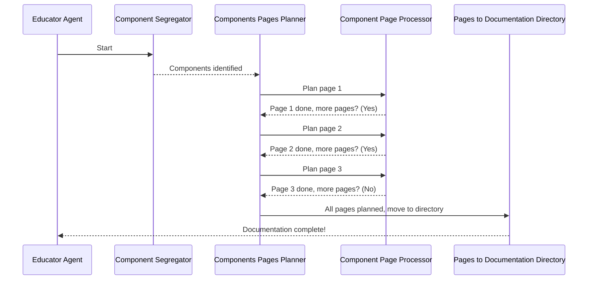

# Chapter 1: Educator Agent Workflow

Welcome to the Agent Documentor project! 👋 This is the very first chapter, where we'll dive into the core of how our agent works.

Imagine you have a bunch of code files, and you want to automatically generate documentation for them. This sounds like a big task, right? Our **Educator Agent Workflow** is designed to handle exactly this! It's like a super-smart assistant that knows exactly what steps to take to turn your code into helpful documentation.

## What is the Educator Agent Workflow? 🤔

Think of the Educator Agent Workflow as a recipe or a step-by-step guide for our documentation agent. It tells the agent:

1.  **What to do first:** Like gathering all the ingredients for a recipe.
2.  **What to do next:** Like chopping vegetables.
3.  **How to decide what to do:** Like deciding if you need more salt or pepper.
4.  **When to stop:** Like knowing when the dish is perfectly cooked!

This workflow is built using a powerful tool called **LangGraph**. LangGraph helps us create sequences of actions, and even make decisions along the way, which is perfect for our documentation task.

## Our Use Case: Documenting Your Code 📝

Let's say you have a Python project with several files. You want to create a nice documentation website for it. The Educator Agent Workflow will orchestrate the process of:

*   Understanding your code files.
*   Figuring out how different parts of your code relate to each other.
*   Planning out the documentation pages.
*   Writing the actual documentation content.
*   Organizing everything into a neat directory structure.

## The Steps Involved: A High-Level View 🗺️

Our Educator Agent Workflow follows a specific path to achieve this. Here's a simplified look at the journey:

1.  **Component Segregator:** First, we need to understand what each piece of your code does. This step separates your code into logical "components."
2.  **Component Relationship Analyser:** Next, we figure out how these components talk to each other. Does one component use another?
3.  **Component Ordering:** Based on their relationships, we decide the best order to document them. Think of it like arranging chapters in a book.
4.  **Components Pages Planner:** Now, we plan out which documentation pages we need and what information should go on each page.
5.  **Component Page Processor:** This is where the actual documentation content is generated for each planned page.
6.  **Pages to Documentation Directory:** Finally, all the generated documentation pages are organized into a clear directory structure, ready for you to use!

## How it Works Under the Hood: A Peek Inside 🕵️‍♀️

To understand how this workflow is built, let's look at the code that defines it.

```python
# educator_agent.py

from langgraph.graph import StateGraph, START, END

from state import State
from agent_nodes import (
    component_segregator,
    component_relationship_analyser,
    component_ordering,
    components_pages_planner,
    component_page_processor,
    pages_to_documentation_directory,
    route_based_on_pages_remaining
)
```

This code imports all the necessary pieces to build our workflow. We're using `StateGraph` from `langgraph` to define the steps and `START` and `END` to mark the beginning and end of our process. We also import various "agent nodes" which are the actual functions that perform each step.

### Building the Workflow 🏗️

```python
def build_educator_agent():
    """Build and return the compiled educator agent workflow."""
    
    educator_agent_builder = StateGraph(State)

    # Add each step as a node
    educator_agent_builder.add_node("component_segregator", component_segregator)
    educator_agent_builder.add_node("component_relationship_analyser", component_relationship_analyser)
    educator_agent_builder.add_node("component_ordering", component_ordering)
    educator_agent_builder.add_node("components_pages_planner", components_pages_planner)
    educator_agent_builder.add_node("component_page_processor", component_page_processor)
    educator_agent_builder.add_node("pages_to_documentation_directory", pages_to_documentation_directory)
```

Here, we create a `StateGraph` and add each of our steps (like `component_segregator`) as a "node" in the graph. Think of nodes as individual tasks.

### Connecting the Steps 🔗

```python
    # Define the flow between nodes
    educator_agent_builder.add_edge(START, "component_segregator")
    educator_agent_builder.add_edge("component_segregator", "component_relationship_analyser")
    educator_agent_builder.add_edge("component_relationship_analyser", "component_ordering")
    educator_agent_builder.add_edge("component_ordering", "components_pages_planner")
```

This part defines the sequence. We're saying: "Start, then go to `component_segregator`, then to `component_relationship_analyser`, and so on."

### Making Decisions: Conditional Edges 🚦

Sometimes, we need to make decisions. For example, after planning pages, we might need to process more pages or we might be done.

```python
    educator_agent_builder.add_conditional_edges(
        "components_pages_planner",
        route_based_on_pages_remaining, # This function decides where to go next
        {
            "pages_to_process": "component_page_processor", # If pages are left, go here
            "no_page_to_process": "pages_to_documentation_directory" # If no pages left, go here
        }
    )
    educator_agent_builder.add_conditional_edges(
        "component_page_processor", 
        route_based_on_pages_remaining,
        {
            "pages_to_process": "component_page_processor", # If more pages to process, loop back
            "no_page_to_process": "pages_to_documentation_directory" # If done, move on
        }
    )
```

`add_conditional_edges` is super cool! It lets us use a function (like `route_based_on_pages_remaining`) to decide which node to go to next. This allows our agent to be flexible.

### Finishing Up 🏁

```python
    educator_agent_builder.add_edge("pages_to_documentation_directory", END)

    return educator_agent_builder.compile()

# Create the compiled agent
educator_agent = build_educator_agent()
```

Finally, we connect the last step to `END` and then `compile()` the whole workflow into a runnable agent.

## A Simple Walkthrough 🚶‍♂️

Let's visualize the flow with a simple example. Imagine we have 3 components to document.



This diagram shows how the agent moves from one step to another, and how it might loop back to process more pages until everything is done.

## What's Next? ➡️

We've just scratched the surface of the Educator Agent Workflow! We've seen how it orchestrates the entire documentation process. In the next chapter, we'll dive deeper into the logic of each individual **[Agent Nodes Logic](02_agent_nodes_logic.md)**. Get ready to explore what makes each step tick! ✨

---

Generated by Kritagya Khandelwal