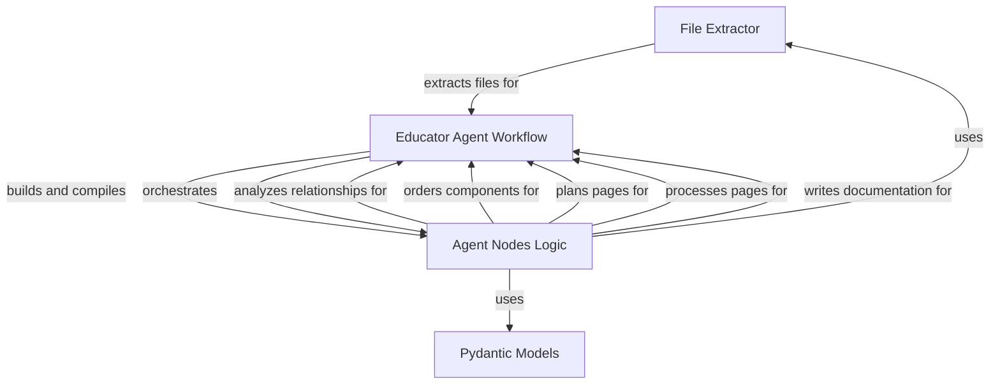

# Tutorial: Agent Documentor

This project is an **AI-powered documentation generator** 🤖, designed to automatically create beginner-friendly tutorials for your codebase. It leverages the power of Large Language Models (LLMs) to understand your project's structure and generate comprehensive documentation. 

At its core, the system works by first **identifying key components** or abstractions within your project. It then analyzes the **relationships** between these components to understand how they interact. Based on this analysis, it creates a **structured learning path**, ordering the components logically for a tutorial. Finally, it generates **individual Markdown files** for each component, complete with explanations, code snippets, and diagrams, creating a full tutorial in a `docs` directory. 📄✨

## Chapters

1. [Educator Agent Workflow](01_educator_agent_workflow.md)
2. [Agent Nodes Logic](02_agent_nodes_logic.md)
3. [File Extractor](03_file_extractor.md)
4. [Pydantic Models](04_pydantic_models.md)

---

Generated by Kritagya Khandelwal